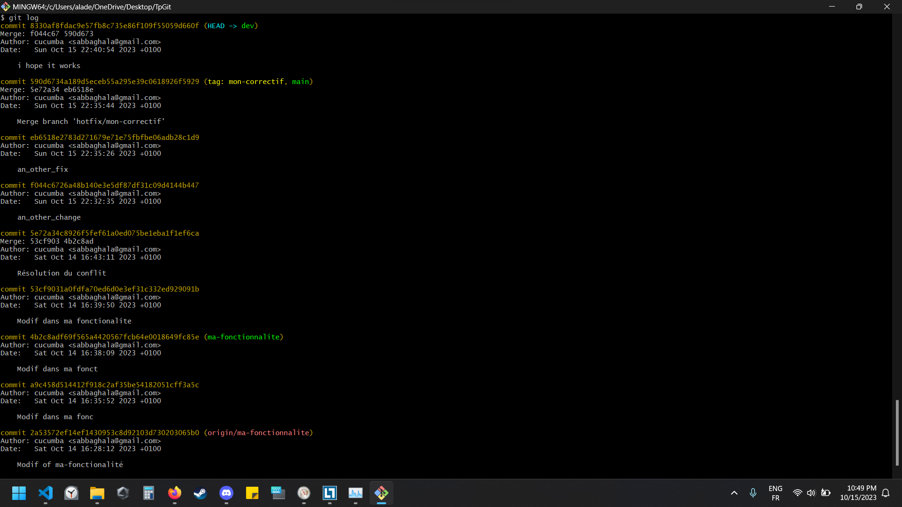

# TpGit
Tp Git

# git history : 

  385  ssh-keygen -t rsa -b 4096 -C sabbaghala@gmail.com
  386  ssh-keygen -t rsa -b 4096 -C sabbaghala@gmail.com
  387  cat ~/ssh/id_rsa.pub
  388  cat ~/.ssh/id_rsa.pub
  389  explrer .ssh
  390  explorer .ssh
  391  cat ~/.ssh/id_rsa.pub
  392  git config --global user.name cucumba
  393  git config --golobal user.email sabbaghala@gmail.com
  394  git config --global user.email sabbaghala@gmail.com
  395  ssh -T git@github.com
  396  git clone git@github.com:SabbaghAladdine/TpGit
  397  cd TpGit
  398  touch index.html
  399  echo 
ftou7 sdir lou7

  400  git add index.html
  401  git commit -m "first commit: added new paragraph"
  402  git log
  403  git diff commit_id_1 commit_id_2
  404  git diff Ini
  405  git diff "first commit: added new paragraph" "Initial commit"
  406  git diff first_commit:_added_new_paragraph Initial_commit
  407  git diff first_commit:_added_new_paragraph Initial_commit
  408  git help
  409  git diff help
  410  git diff --help
  411  git branch ma-fonctionnalite
  412  git diff first_commit Initial_commit
  413  git diff first_commit Initial_commit
  414  git checkout ma-fonctionnalite
  415  git add
  416  git add .
  417  git commit -m "Modif of ma-fonctionalité"
  418  git push origin ma-fonctionnalite
  419  git push origin ma-fonctionnalite
  420  git checkout master
  421  git checkout main
  422  git branch
  423  git checkout main
  424  git commit -am "Modif dans ma fonc"
  425  git checkout main
  426  git checkout master
  427  git commit -am "Modif dans ma fonctionalité"
  428  git merge ma-fonctionalite
  429  git checkout ma-fonctionalite
  430  git checkout ma-fonctionnalite
  431  git commit -am "Modif dans ma fonct"
  432  git checkout master
  433  git checkout main
  434  git commit -am "Modif dans ma fonctionalite"
  435  git merge ma-fonctionnalite
  436  git add .
  437  git commit -m "Résolution du conflit"
  438  git flow init
  439  git branch dev
  440  git flow init
  441  git flow init
  442  git flow --help
  443  git flow help
  444  git flow config
  445  git log
  446  git
  447  git log
  448  git flow --help
  449  git flow help
  450  git flow config
  451  git flow init
  452  git flow init
  453  git flow config
  454  git flow config
  455  git flow feature start ma-fonctionnalite
  456  git flow release start ma-version
  457  git flow feature finish ma-fonctionnalite
  458  git add.
  459  git add .
  460  git commit -m an other change
  461  git commit -m "an_other_change"
  462  git flow feature finish ma-fonctionnalite
  463  git flow hotfix start mon-correctif
  464  git flow hotfix finish mon-correctif
  465  git commit -m "an_other_fix"
  466  git commit -am "an_other_fix"
  467  git flow hotfix finish mon-correctif
  468  git flow hotfix finish mon-correctif
  469  git rebase
  470  git branch
  471  git checkout hotfix/mon-correctif
  472  git rebase
  473  git rebase .
  474  git merge
  475  git commit -am "i hope it works"
  476  git merge
  477  git commit -am "i hope it works"
  478  git rebase
  479  git flow hotfix finish mon-correctif
  480  git log
  481  git commit -am "i hope this is the last commit"
  482  git push
  483  git merge
  484  git add .
  485  git commit -m "i truely hope this is the ned"
  486  git push
  487  git push
  488  git push --set-upstream origin dev
  489  history

